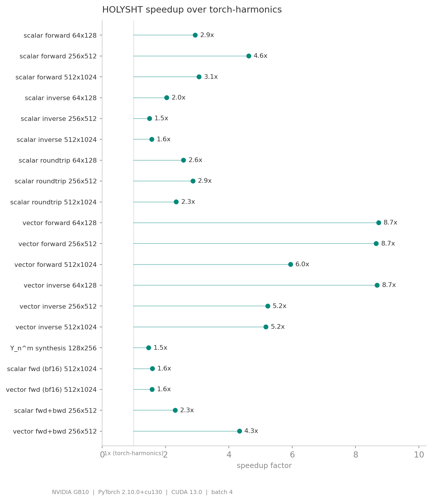
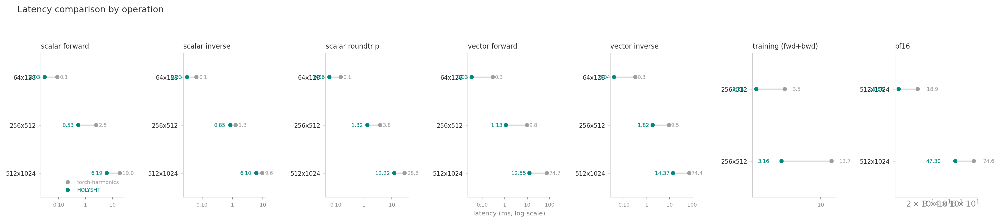

# HOLYSHT: highly optimised Legendre $Y_l^m$ SHT

HOLYSHT is a focused CUDA acceleration layer for spherical harmonic transforms
in the `torch-harmonics` ecosystem. It keeps the parts that proved real in
benchmarking: custom CUDA Legendre kernels, dedicated vector SHT kernels,
explicit autograd support, mixed-precision forward paths, and a profiling setup
that can be run safely on a GB10 without blowing memory.

The package is designed as a practical companion to
[`torch-harmonics`](https://github.com/NVIDIA/torch-harmonics), not a full
reimplementation. HOLYSHT still reuses `torch-harmonics` to generate quadrature
weights, then replaces the slowest execution paths with CUDA code tuned for the
current Blackwell-era target.

<p align="center">
  
  <br>
  <sub>Spectral advection on Mars (256×512 grid, real MOLA topography). Left: terrain + weather. Right: flow dynamics with velocity streamlines. Simulated at 300+ frames/s on an NVIDIA GB10.</sub>
</p>

## What this repo contains

- `torch-ext/holysht/`
  The public Python package with drop-in `RealSHT`, `InverseRealSHT`,
  `RealVectorSHT`, and `InverseRealVectorSHT` modules.
- `cuda/`
  CUDA kernels for scalar Legendre, vector Legendre composition, BF16 real
  reductions, and inverse-FFT preparation.
- `torch-ext/torch_binding.cpp`
  Torch extension registration for the CUDA ops.
- `benchmarks/`
  End-to-end benchmarks for forward, inverse, training, and BF16 paths.
- `scripts/`
  Small profiling and resource-report helpers for `nsys`, `ncu`, and
  `cuobjdump`.
- `tests/`
  Parity tests against `torch-harmonics`, including backward and non-contiguous
  input coverage.

## Performance

Benchmarked on an NVIDIA GB10 with PyTorch 2.10.0+cu130, CUDA 13.0, batch
size 4. All 20 correctness checks passed; mean speedup **3.9x**.

<p align="center">
  
</p>

Vector SHT benefits most (up to **8.7x**) because the fused kernel avoids two
separate Legendre passes. Scalar forward peaks at **4.6x** on the 256×512 grid
where the tiled shared-memory kernel is most effective. BF16 paths use an
einsum shortcut (not the CUDA kernels), so speedup there is modest (~1.6x).

<p align="center">
  
</p>

<details>
<summary>Full benchmark table</summary>

### Scalar SHT

| Workload | Grid | torch-harmonics | HOLYSHT | Speedup |
|---|---|---:|---:|---:|
| Forward | 64x128 | 0.089 ms | 0.030 ms | 2.9x |
| Forward | 256x512 | 2.473 ms | 0.534 ms | 4.6x |
| Forward | 512x1024 | 18.959 ms | 6.192 ms | 3.1x |
| Inverse | 64x128 | 0.065 ms | 0.032 ms | 2.0x |
| Inverse | 256x512 | 1.269 ms | 0.847 ms | 1.5x |
| Inverse | 512x1024 | 9.566 ms | 6.100 ms | 1.6x |
| Forward + inverse | 64x128 | 0.148 ms | 0.057 ms | 2.6x |
| Forward + inverse | 256x512 | 3.804 ms | 1.324 ms | 2.9x |
| Forward + inverse | 512x1024 | 28.555 ms | 12.221 ms | 2.3x |
| Forward + backward | 256x512 | 3.489 ms | 1.512 ms | 2.3x |

### Vector SHT

| Workload | Grid | torch-harmonics | HOLYSHT | Speedup |
|---|---|---:|---:|---:|
| Forward | 64x128 | 0.299 ms | 0.034 ms | 8.7x |
| Forward | 256x512 | 9.821 ms | 1.135 ms | 8.7x |
| Forward | 512x1024 | 74.689 ms | 12.545 ms | 6.0x |
| Inverse | 64x128 | 0.312 ms | 0.036 ms | 8.7x |
| Inverse | 256x512 | 9.524 ms | 1.820 ms | 5.2x |
| Inverse | 512x1024 | 74.351 ms | 14.374 ms | 5.2x |
| Forward + backward | 256x512 | 13.723 ms | 3.162 ms | 4.3x |

### BF16

| Workload | Grid | torch-harmonics | HOLYSHT | Speedup |
|---|---|---:|---:|---:|
| Scalar forward | 512x1024 | 18.881 ms | 11.852 ms | 1.6x |
| Vector forward | 512x1024 | 74.606 ms | 47.304 ms | 1.6x |

</details>

## Profiling and resources

The project now ships a lightweight profiling path that avoids the heavyweight
`kernel-builder` workflow during normal development:

- First import builds a local torch extension under `build/torch_extensions/`.
- The loader defaults to `MAX_JOBS=1` and `TORCH_CUDA_ARCH_LIST=12.0+PTX` on
  GB10-class machines.
- `scripts/profile_nsys.sh` profiles the scalar forward case with `nsys`.
- `scripts/profile_ncu.sh` attempts `ncu`; if GPU counters are unavailable for
  the current user it falls back to `scripts/report_resources.py`.

Representative `nsys` runs on `512x1024`, batch `4`:

- `fused_legendre_forward_large_kernel<8>` averaged `6.18 ms` across `31`
  launches in the scalar-forward profile.
- `fused_vector_legendre_forward_large_kernel<8>` averaged `12.42 ms` across
  `31` launches in the vector-forward profile.

Current resource snapshot from `cuobjdump --dump-resource-usage` on the local
build:

| Kernel | Regs/thread | Shared/block | Block threads | Active blocks/SM | Theoretical occupancy |
|---|---:|---:|---:|---:|---:|
| Scalar forward large | 38 | 3136 B | 256 | 6 | 100.0% |
| Scalar inverse large | 40 | 3136 B | 256 | 6 | 100.0% |
| Vector forward large | 37 | 5248 B | 256 | 6 | 100.0% |
| Vector inverse large | 40 | 5248 B | 256 | 6 | 100.0% |
| BF16 forward large | 34 | 2080 B | 256 | 6 | 100.0% |
| `prepare_irfft` | 19 | 0 B | n/a | n/a | n/a |

## Public API

```python
import torch
from holysht import RealSHT, InverseRealSHT, RealVectorSHT

sht = RealSHT(512, 1024, grid="equiangular", norm="ortho", csphase=True).cuda()
isht = InverseRealSHT(512, 1024).cuda()

x = torch.randn(4, 512, 1024, device="cuda")
coeffs = sht(x)
x_back = isht(coeffs)

vsht = RealVectorSHT(512, 1024).cuda()
v = torch.randn(4, 2, 512, 1024, device="cuda")
v_coeffs = vsht(v)
```

The module constructors accept the same practical arguments as
`torch-harmonics`: `nlat`, `nlon`, `lmax`, `mmax`, `grid`, `norm`, and
`csphase`. HOLYSHT also exposes `dtype="bf16"` for forward real and vector
paths.

## Development notes

- The default CUDA path now uses architecture-aware launch selection with
  runtime-tunable `HOLYSHT_TILE_L` and `HOLYSHT_SMALL_GRID_THRESHOLD`
  overrides.
- `HOLYSHT_ENABLE_NVTX=1` enables NVTX ranges around the public hot paths.
- `HOLYSHT_USE_FAST_MATH=0` disables `--use_fast_math` for the local JIT build.
- `build.toml` is pinned to `sm_120` for the kernel-builder path so it no
  longer tries to fan out across a wide architecture matrix on GB10.
- The benchmark runner still honours `HOLYSHT_MAX_ALLOC_GIB` or
  `--max-alloc-gib` to avoid unified-memory overcommit.

## Running benchmarks

```bash
PYTHONPATH=torch-ext python3 benchmarks/bench_torch_harmonics.py --quick --max-alloc-gib 6
```

To profile a single case:

```bash
./scripts/profile_nsys.sh
./scripts/profile_ncu.sh
python3 scripts/report_resources.py
```

## Running tests

```bash
PYTHONPATH=torch-ext pytest tests/test_holysht.py
```

## Author

## Author

I'm [Chris von Csefalvay](chrisvoncsefalvay.com), an AI researcher specialising in post-training, and the author of _[Post-Training: A Practical Guide for
AI Engineers and Developers](https://posttraining.guide)_ (No Starch Press, 2026). I also write [Post-Slop](https://postslop.substack.com), a periodic diatribe about AI, and what it's doing for society. You can also find me on [LinkedIn](https://linkedin.com/in/chrisvoncsefalvay) and [X](https://x.com/epichrisis).

## License

MIT
